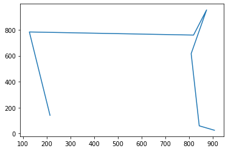

Given a list of cities and coordinates for each city, find the shortest path as the crow flies.


```python
from random import randint
import matplotlib.pyplot as plt
import math
```


```python
def generate_city_coordinates(num_cities):
    cities_coordinates = []
    for city in range(num_cities):
        x = randint(0,1000)
        y = randint(0,1000)
        cities_coordinates.append([x,y])
    return cities_coordinates
```


```python
cities_coordinates = generate_city_coordinates(7)
print(cities_coordinates)
```

    [[214, 141], [809, 616], [819, 759], [127, 783], [874, 953], [907, 26], [843, 60]]


```python
x_coords = []
y_coords = []
for coordinate in cities_coordinates:
    x_coords.append(coordinate[0])
    y_coords.append(coordinate[1])
plt.plot(x_coords, y_coords, "ro")
plt.show()
```


    

    


```python
def shuffle_points(point_a, point_b, point_c):
    original_point_a = point_a[point_b]
    point_a[point_b] = point_a[point_c]
    point_a[point_c] = original_point_a
```


```python
def calculate_pythagorean_distance_sum(coordinates_list):
    total_distance = 0
    for n in range(len(coordinates_list)-1):
        distance = ((coordinates_list[n][0] - coordinates_list[n+1][0]) ** 2 + (coordinates_list[n][1] - coordinates_list[n+1][1]) ** 2) ** 0.5
        total_distance += distance
    return total_distance
```


```python
iteration = 0
shortest_distance = None
shortest_coordinate_path = []
x_coords = []
y_coords = []
iteration = 0
while iteration < 100000:
    iteration += 1
    point_a = randint(0, len(cities_coordinates)-1)
    point_b = randint(0, len(cities_coordinates)-1)
    shuffle_points(cities_coordinates, point_a, point_b)
    distance = calculate_pythagorean_distance_sum(cities_coordinates)
    if shortest_distance is None or distance < shortest_distance:
        shortest_distance = distance
        # shortest_coordinate_path = cities_coordinates No, references mutating value
        shortest_coordinate_path = cities_coordinates.copy()
        x_coords = []
        y_coords = []
        for coordinate in shortest_coordinate_path:
            x_coords.append(coordinate[0])
            y_coords.append(coordinate[1])
        print(f"Coordinate path: {shortest_coordinate_path} \n Shortest Distance: {shortest_distance}")
        plt.plot(x_coords, y_coords)
    plt.show()
```

    Coordinate path: [[214, 141], [907, 26], [819, 759], [127, 783], [874, 953], [809, 616], [843, 60]] 
     Shortest Distance: 3799.506375297371


    

    


    Coordinate path: [[809, 616], [127, 783], [874, 953], [819, 759], [214, 141], [907, 26], [843, 60]] 
     Shortest Distance: 3309.682613831005


    

    


    Coordinate path: [[907, 26], [843, 60], [809, 616], [874, 953], [819, 759], [127, 783], [214, 141]] 
     Shortest Distance: 2514.6504181615965


    

    


    Coordinate path: [[874, 953], [819, 759], [809, 616], [127, 783], [214, 141], [907, 26], [843, 60]] 
     Shortest Distance: 2469.959569221126


    

    


    Coordinate path: [[874, 953], [819, 759], [809, 616], [907, 26], [843, 60], [214, 141], [127, 783]] 
     Shortest Distance: 2297.6112615442125


    

    

